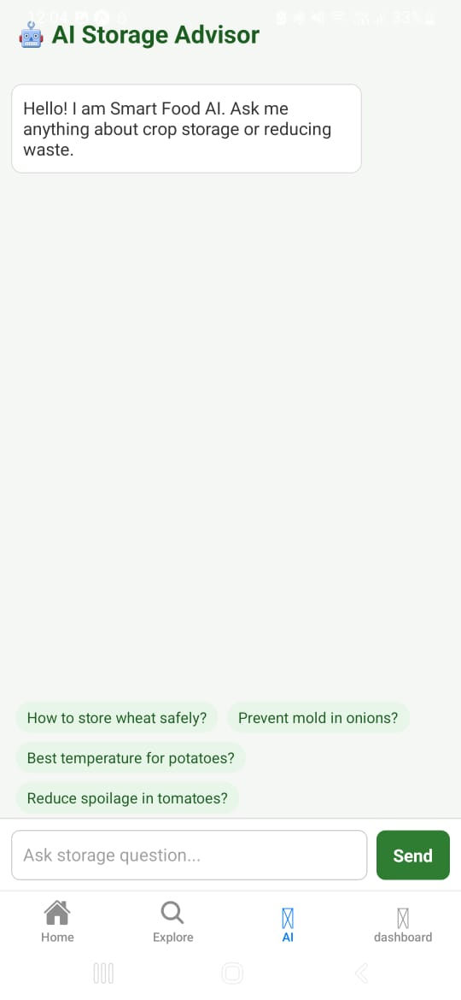
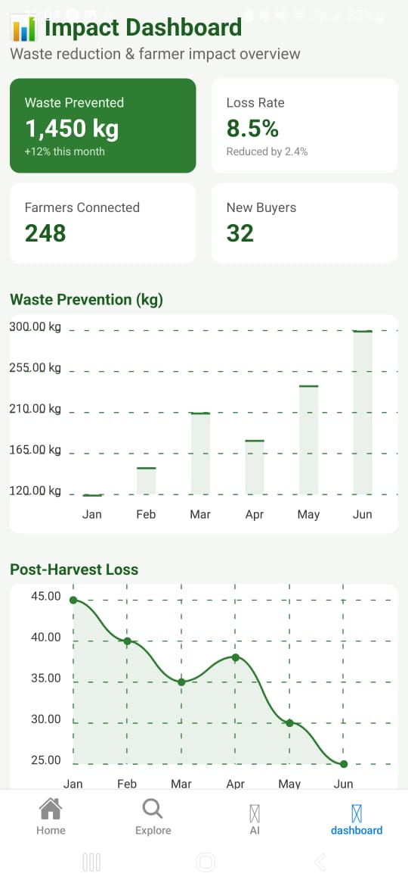

# 🌾 Smart Food AI
### *Predictive Food Survival Intelligence for Bharat*
**AI for Bharat Hackathon | Prototype Phase**

**Smart Food AI** is a cloud-native platform designed to empower farmers and street vendors. By leveraging the **ANNAPURNA AI Engine**, we provide actionable insights to prevent spoilage and stabilize income in the Indian agricultural supply chain.

---

## 🧠 The Intelligence Core: ANNAPURNA AI Engine
ANNAPURNA AI is our central decision intelligence system. It transforms fragmented agricultural data into a unified predictive framework to ensure food security.

### 🧪 Spoilage Intelligence Module (SIM)
* **Function:** Predicts crop deterioration using biological decay curves and weather models.
* **UI Integration:** Powers the **shelf-life indicators** and storage advice in the AI Advisor.

### 📊 Demand Intelligence Module (DIM)
* **Function:** Analyzes seasonal spikes and Mandi transaction patterns to predict hyperlocal consumption.
* **UI Integration:** Curates the **Marketplace** feed to match vendor stock with buyer needs.

### 📈 Economic Optimization Module (EOM)
* **Function:** Maximizes profitability by identifying price surge windows and market priority.
* **UI Integration:** Drives the **Impact Dashboard** metrics to show farmers their saved revenue.

---

## 📱 Interface Preview
Our high-fidelity prototype focuses on clarity for vendors and real-time freshness tracking.

### Phase 1: Market & Inventory
| **Home Dashboard (EOM)** | **Smart Explore (DIM)** | **Freshness Cart (SIM)** |
| :---: | :---: | :---: |
|  |  |  |
| *Market Rates & Trends* | *AI Discovery* | *Shelf-Life Tracking* |

### Phase 2: AI Interaction & Impact
| **AI Storage Advisor** | **Impact Dashboard** | **Marketplace Detail** |
| :---: | :---: | :---: |
|  |  |  |
| *Generative Guidance* | *Waste Prevention (1,450kg)* | *Regional Pricing* |

> **[🎥 Watch the Interactive UI Demo Video](assets/images/Green%20Modern%20Vegetable%20Food%20Menu%20Mobile%20Design.mp4)**

---

## 🏗 Architecture & Tech Stack
| Layer | Technology |
| :--- | :--- |
| **Frontend** | React Native / Expo (Cross-platform) |
| **AI Engine** | **Amazon Bedrock** (ANNAPURNA AI) |
| **Backend** | Node.js |
| **Storage** | GitHub Managed Assets |

---

## ⭐ Unique Value Proposition (USP)
* **Hyperlocal Context:** Tailored specifically for the Indian "Mandi" system and local vendor needs.
* **Waste Prevention:** Real-time tracking of post-harvest loss reduction (currently 8.5% reduction).
* **Accessibility First:** Minimalist, high-contrast UI designed for outdoor use by farmers and vendors.

---

## 👥 Team STRYX
| Name | Role |
| :--- | :--- |
| **Pratheeksha Shalbin** | UI Lead & Repository Management |
| **Khushi** | Backend & AI Model Development |
| **Deekshanya Shri L** | UX Design & Frontend Logic |
| **Shanney Maria George** | Data Research & Analysis |
