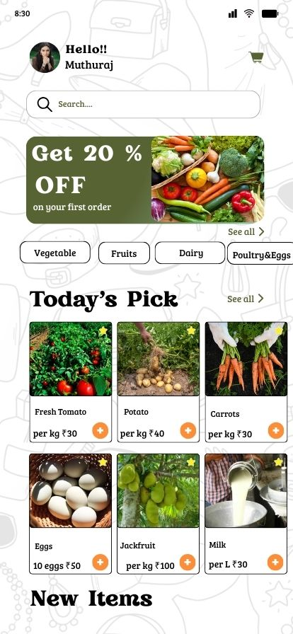
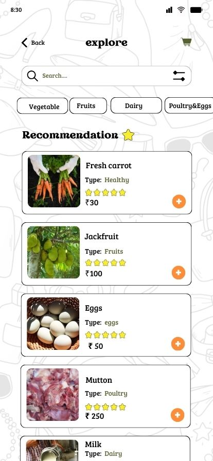
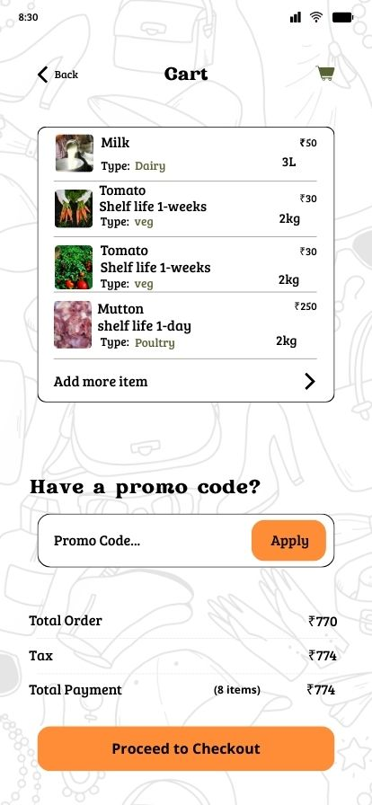

# 🌾 Smart Food AI
### *Predictive Food Survival Intelligence for Bharat*
**AI for Bharat Hackathon | Prototype Phase**

**Smart Food AI** is a cloud-native platform designed to empower farmers and street vendors. By leveraging the **ANNAPURNA AI Engine**, we provide actionable insights to prevent spoilage and stabilize income in the Indian agricultural supply chain.

---

## 🧠 The Intelligence Core: ANNAPURNA AI Engine
ANNAPURNA AI is our central decision intelligence system. It transforms fragmented agricultural data into a unified predictive framework to ensure food security.

### 🧪 Spoilage Intelligence Module (SIM)
* **Function:** Predicts crop deterioration using biological decay curves and weather models.
* **UI Integration:** Powers the **1-week/1-day** shelf-life indicators seen in the Smart Cart.

### 📊 Demand Intelligence Module (DIM)
* **Function:** Analyzes seasonal spikes and Mandi transaction patterns to predict hyperlocal consumption.
* **UI Integration:** Curates the **Recommendations** feed to match vendor stock with buyer needs.

### 📈 Economic Optimization Module (EOM)
* **Function:** Maximizes profitability by identifying price surge windows and market priority.
* **UI Integration:** Highlights high-value items in the **Today's Pick** section.

---

## 📱 Interface Preview
Our high-fidelity prototype focuses on clarity for vendors and real-time freshness tracking.

| **Home Dashboard (EOM)** | **Smart Explore (DIM)** | **Freshness Cart (SIM)** |
| :---: | :---: | :---: |
|  |  |  |
| *Market Rates & Trends* | *AI Discovery* | *Shelf-Life Tracking* |

> **[🎥 Watch the Interactive UI Demo Video](assets/images/Green%20Modern%20Vegetable%20Food%20Menu%20Mobile%20Design.mp4)**

---

## 🏗 Architecture & Tech Stack
We utilize a modern, scalable, and cost-effective serverless stack:

| Layer | Technology |
| :--- | :--- |
| **Frontend** | React.js / Expo (Web-optimized) |
| **Hosting** | **AWS Amplify** |
| **AI Engine** | **Amazon Bedrock** (Amazon Nova Micro) |
| **Backend** | **AWS Lambda** (Serverless Node.js) |
| **Database** | Amazon DynamoDB |

### **Wireframe Evolution**


---

## ⭐ Unique Value Proposition (USP)
* **Hyperlocal Context:** Tailored specifically for the Indian "Mandi" system and local vendor needs.
* **Serverless Efficiency:** High performance with near-zero idle costs using **Amazon Nova Micro**.
* **Accessibility First:** Minimalist, high-contrast UI designed for outdoor use and varying levels of digital literacy.

---

## 👥 Team STRYX
| Name | Role | Core Responsibility |
| :--- | :--- | :--- |
| **Pratheeksha Shalbin** | Team Lead | UI Lead & Repository Management |
| **Khushi** | Backend/AI | AI Model Development & Cloud Integration |
| **Deekshanya Shri L** | UX Designer | UX Design & Frontend Logic |
| **Shanney Maria George** | Researcher | Data Research & Analysis |

---

## 📂 Project Structure
```text
smart-food-ai
├── app             # Frontend React/Expo Codebase
├── assets          # Media Assets
│   └── images      # UX Screens & Demo Video
├── design          # UI/UX Wireframes & System Design
├── requirements.md # Technical Specifications
└── README.md       # Project Overview
