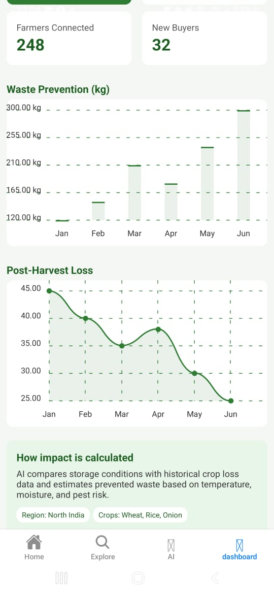

# 🌾 Smart Food AI
### *Predictive Food Survival Intelligence for Bharat*
**AI for Bharat Hackathon | Prototype Phase**

**Smart Food AI** is a cloud-native platform designed to empower farmers and street vendors. By leveraging the **ANNAPURNA AI Engine**, we provide actionable insights to prevent spoilage and stabilize income in the Indian agricultural supply chain.

---

## 🧠 The Intelligence Core: ANNAPURNA AI Engine
ANNAPURNA AI is our central decision intelligence system. It transforms fragmented agricultural data into a unified predictive framework to ensure food security.

### 🧪 Spoilage Intelligence Module (SIM)
* **Function:** Predicts crop deterioration using biological decay curves and weather models.
* **UI Integration:** Powers the **shelf-life indicators** and storage advice in the AI Advisor.

### 📊 Demand Intelligence Module (DIM)
* **Function:** Analyzes seasonal spikes and Mandi transaction patterns to predict hyperlocal consumption.
* **UI Integration:** Curates the **Marketplace** feed to match vendor stock with buyer needs.

### 📈 Economic Optimization Module (EOM)
* **Function:** Maximizes profitability by identifying price surge windows and market priority.
* **UI Integration:** Drives the **Impact Dashboard** metrics to show farmers their saved revenue.

---

## 📱 Interface Preview
Our high-fidelity prototype focuses on clarity for vendors and real-time freshness tracking.

## 📱 Interface Preview
Our high-fidelity prototype is structured to provide immediate value to farmers, transitioning from market awareness to AI-driven action.

### Phase 1: Market & Inventory 🌾
Focuses on real-time awareness and connecting farmers to the hyperlocal "Mandi" system.

| **Home Dashboard** | **Smart Explore** | **The Challenge** |
| :---: | :---: | :---: |
|  |  |  |
| *Market Rates & Trends* | *Grain Price Tracking* | *Identifying Pain Points* |

---

### Phase 2: AI Interaction & Impact

| Feature | Mobile Interface | Purpose |
| :--- | :---: | :--- |
| **Home Screen** |  | Entry point for advice and market exploration. |
| **Challenges** |  | Identifying storage & market access pain points. |
| **AI Advisor** |  | **ANNAPURNA AI** chat for crop safety. |
| **Impact** |  | Tracking waste prevented (1,450 kg). |
| **Marketplace** |  | Direct buyer-seller listings with regional pricing. |
| **Marketplace** |  | Direct buyer-seller listings with regional pricing. |
| **Dashboard** |  | Tracking waste prevented (1,450 kg). |

> **[🎥 Watch the Interactive UI Demo Video](assets/images/Green%20Modern%20Vegetable%20Food%20Menu%20Mobile%20Design.mp4)**

---

## 🏗 Architecture & Tech Stack
| Layer | Technology |
| :--- | :--- |
| **Frontend** | React Native / Expo (Cross-platform) |
| **AI Engine** | **Amazon Bedrock** (ANNAPURNA AI) |
| **Backend** | Node.js |
| **Storage** | GitHub Managed Assets |

---

## ⭐ Unique Value Proposition (USP)
* **Hyperlocal Context:** Tailored specifically for the Indian "Mandi" system and local vendor needs.
* **Waste Prevention:** Real-time tracking of post-harvest loss reduction (currently 8.5% reduction).
* **Accessibility First:** Minimalist, high-contrast UI designed for outdoor use by farmers and vendors.

----

smart-food-ai (Team STRYX Contributions)
├── app.json                # App configuration & identity
├── App.js                  # Main logic for ANNAPURNA AI display
├── App.css                 # Green-Tech UI styling system
├── components
│   └── ui
│       ├── icon-symbol.tsx # Custom ANNAPURNA icon mapping
│       └── AiCard.tsx      # Reusable AI insight component
├── assets
│   └── images              # Finalized UX Screens & Demo Video
│       ├── home.jpg        # Home & Entry
│       ├── challenges.jpg  # Problem Identification
│       ├── chat.jpg        # AI Advisor Interface
│       ├── dashboard.jpg   # Impact & Analytics
│       ├── marketplace_1.jpg # Grain Market
│       └── marketplace_2.jpg # Vegetable Market
└── README.md               # Project documentation

----
----

## 👥 Team STRYX
| Name | Role |
| :--- | :--- |
| **Pratheeksha Shalbin** | UI Lead & Repository Management |
| **Khushi Jain** | Backend & AI Model Development |
| **Deekshanya Shri L** | UX Design & Frontend Logic |
| **Shanney Maria George** | Data Research & Analysis | 
